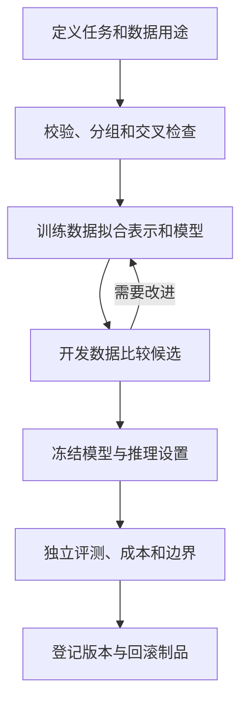

# 通用模型训练底层逻辑

日期：2026-09-28。状态：第一版传统 ML 训练工程已在独立仓库实现并完成工程验收；见[实施记录](implementation-plan.md)和[工程验收报告](engineering-verification.json)。

本仓库从文件上传项目增量迁移代码，原交付目录保持只读。正式模型、真实数据和历史报告属于外部受保护资产，不随公开仓库分发。语言、视觉只用于检验接口边界，目前没有对应训练后端。

## 1. 可复用的逻辑

| 环节 | 必须回答的问题 | 留下的记录 |
|---|---|---|
| 目标 | 希望改善什么，错误代价是什么？ | 任务定义、验收指标、限制 |
| 输入输出 | 上线能拿到什么，返回什么？ | 任务 schema 与信息边界 |
| 学习信号 | 用哪些例子学习，目标从哪里来？ | 来源、标签状态、目标映射 |
| 隔离与评测 | 哪些用于拟合、选型、最终检验？ | 分区用途、指纹与评测报告 |
| 表示与学习 | 怎样表示输入，怎样拟合？ | 编码器、算法和训练配置 |
| 比较与定型 | 相比基线改善什么，还有哪些失败？ | 开发指标、成本与限制 |
| 使用与交付 | 如何重载、追溯与回滚？ | 完整制品、版本与环境记录 |
| 反馈与迭代 | 哪些问题核实后进入下一版？ | 新数据版本与改进假设 |

目标决定需要的数据；数据决定可学习的范围；学习目标决定如何拟合；独立评测检验效果。扩大模型不能保证弥补输入中缺失的信息。

## 2. 从上传任务拆出的边界

上传任务判断的是：上游已认定为上传攻击后，服务端是否接收或保存了文件。它不负责原始攻击识别，也不证明文件可执行或主机失陷。

| 原上传做法 | 已抽出的公共能力 | 保留在上传任务中的内容 |
|---|---|---|
| 请求/响应事件 | 样本编号、来源、分组与用途管理 | HTTP schema、文件元信息 |
| confirmed/likely 合并为正类 | 显式目标转换和排除统计 | 上传标签映射及 unknown 排除 |
| TF-IDF + 24 维特征 | 文本编码、外部数值矩阵、维度校验 | 文本拼接、特征含义及列顺序 |
| LightGBM / Logistic Regression | 多类别拟合、预测、保存和加载 | 哪一类代表上传成功 |
| 规则优先、模型回退 | 任务自定义推理流程 | 证据、阈值、规则短路与四类决策 |
| 上传四类指标 | 评测调度与报告留存 | TDP/语义指标及其含义 |
| 版本清单 | 制品完整性、环境和数据记录 | 旧 joblib 格式兼容 |

[SparseClassifier](../src/training_backends/sparse_classifier.py) 独立执行训练，不调用旧上传类的 `fit()`；相反，[UploadClassifier](../src/upload_judge/ml_model.py) 委托共享后端。公开文本三分类实例也使用同一后端，类别为 food、travel、technology。

原上传数据统计为 14,105 条记录、13,173 条拟合、932 条 unknown 排除；这是外部历史资产的统计，并非本仓库自带数据。仓库中的上传示例只有 49 条合成记录，48 条拟合、1 条排除。

## 3. 训练和使用分开

1. 词表、统计量和特征选择只在训练侧拟合。预测使用已保存的表示，不重新拟合。
2. `train` 命令只读取配置中的 `train` 和 `development`；不会打开最终测试分区。
3. 所有用于选模型、改特征或调阈值的数据都应登记为 development。看过测试结果并据此改进后，它对后续版本不再是独立测试。
4. ID、内容、模板和分组指纹是辅助证据，无交叉不能证明真实独立性，也不能证明来源声明真实。
5. 历史金标可以检查回归，不再承担“未见数据”的证明责任。

推理加载冻结制品并执行任务自己的输出处理。上传仍然先运行规则：**强规则解决的事件跳过模型，只有剩余事件进入模型和证据决策**。该顺序由[上传策略](../src/training_tasks/upload/policy.py)复用原[研判编排](../src/upload_judge/judge.py)。

## 4. 真实实现的职责

| 层 | 实现 | 职责 |
|---|---|---|
| 契约 | [contracts.py](../src/training_core/contracts.py) | Sample、Prediction、DatasetSpec、TaskSpec 和 TaskAdapter 协议 |
| 数据 | [data.py](../src/training_core/data.py) | 读取、目标状态、确定性合并与 hash |
| 隔离 | [splits.py](../src/training_core/splits.py) | 分区报告、可携带的成员指纹 lineage 和用途检查 |
| 制品 | [artifacts.py](../src/training_core/artifacts.py) | 新运行目录、写入保护、完整性与环境记录 |
| 编排 | [runner.py](../src/training_core/runner.py) | Workflow 的 validate_data/train/predict/evaluate |
| 算法 | [sparse_classifier.py](../src/training_backends/sparse_classifier.py) | TF-IDF、外部结构特征、两种分类器 |
| 任务 | [上传](../src/training_tasks/upload/adapter.py)、[文本分类](../src/training_tasks/text_classification.py) | schema、目标、表示、预测与指标 |
| 组合入口 | [registry.py](../src/training_tasks/registry.py) | 显式选择任务，将解析函数注入公共 CLI |

公共核心不导入上传模块，不强制概率、四分类、confidence、证据或拒判，也不统一反向传播。树模型与神经网络可以使用不同的拟合过程。

实际 TaskAdapter 包含 `parse`、`fingerprints`、`prepare`、`fit`、`predict`、`save`、`load`、`evaluate`。可选策略由适配器内部编排；当前没有额外的通用规则引擎。制品格式是 `manifest.json`，不是另一个 ArtifactManifest 类。

## 5. 不应混淆的概念

| 概念 | 当前处理 |
|---|---|
| labeled | 合法目标可经映射参与监督拟合 |
| unlabeled | 未标注，排除并统计 |
| unresolved | 待确认，保留状态并排除 |
| conflict | 结论冲突，保留状态并排除 |
| 上传 unknown 标签 | 已标注的合法语义结论，但从当前二分类拟合排除 |
| 模型拒判 | 预测状态，不能自动当成真值回流 |

标签优先级决定采用哪份结论；样本权重决定拟合贡献；模型参数是学习得到的数值或结构。当前没有新增来源加权策略。固定标签任务遇到非法标签报错；文本示例接受任意非空字符串类别。

上传 confidence 混合模型分数、规则固定值和上下限，不能当作统一校准的正确率。二分类训练目标与最终四类研判结论也需要分别评测。训练误差下降不等于业务效果改善。

文本/图像是数据模态；预训练、继续预训练、监督微调描述学习阶段；全参、冻结骨干、LoRA 描述参数更新方式。SFT 可以采用 LoRA。当前实现不包含这些神经网络训练后端。

## 6. 工程证据和当前限制

[verification.json](verification.json) 记录：原项目测试基线 168 项通过；同一正式模型 3,009 条完整输出差异 0；49 条合成上传记录中 48 条参与拟合，两后端的词表、IDF、特征、参数、学习结果和预测一致；173 个登记原资产在验证前后 hash 未改变。基线测试使用依赖版本与原环境一致的新解释器，只读运行原项目源码，没有修改原环境。

这些是迁移兼容证据，不证明精度提高或新场景泛化。文本实例已经完成 24 条训练、6 条开发的真实分类训练。[整体验收](engineering-verification.json)记录 276 项测试通过，失败、错误、跳过均为 0；已安装的 model-workflow 命令入口退出码为 0。复验方法见[使用手册](generic_training.md)。

制品的训练 lineage 和后续 evaluation_history 共同帮助追踪数据使用。后者追加记录，不修改冻结的模型与 manifest。同一冻结模型的重复评测是复验，不是新测试数据。迁移时必须保留完整目录；软件仍无法自动捕获目录外的人为选型。

目前未实现语言生成、视觉、分布式训练、大规模流式管线、通用自动调参、自动校准或部署晋级。数据读取与当前任务预测以列表为主，接口可扩展不代表这些能力已经实现。

## 7. 新任务先写任务卡

任务卡应包含：业务目标和错误代价；上线输入及可用时间；输出与边界；数据来源、样本单位和同源分组；原始目标、训练目标和标注状态；四种数据用途；模型与表示；训练预算；推理和指标；完整制品与反馈复核。

先明确这些内容，再实现适配器。操作说明见[使用手册](generic_training.md)，本轮实施状态见[实施记录](implementation-plan.md)。
